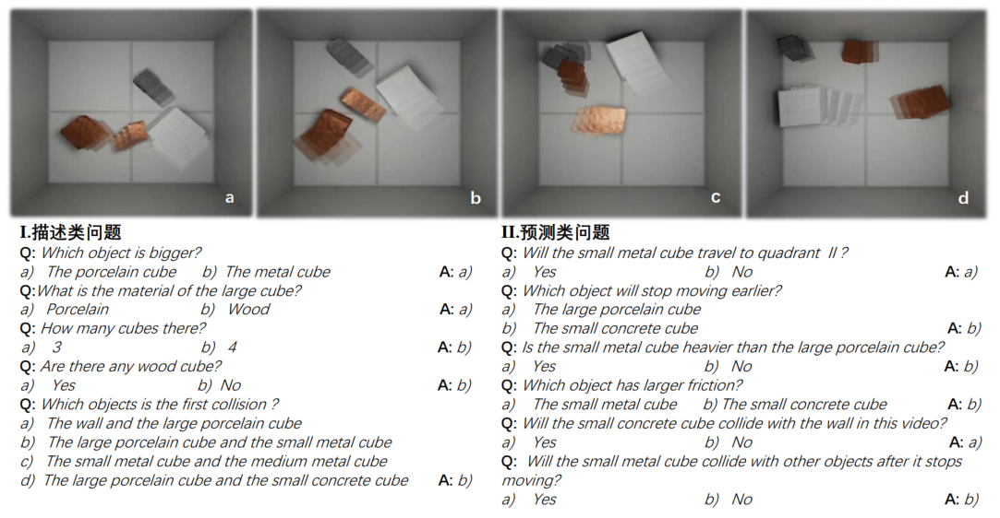

# PhyInP

**PhyInP: A Physical Dataset for Intrinsic Properties Compositional Reasoning**

PhyInP dataset aims to evaluate the ability of the model to extract potential information from spatio-temporal data and combine reasoning. PhyInP is designed in a visual question and answer format, including the video of the rendered scene and questions about the future results of the system. 

## Framework
<div align="center">
  
</div>
## Usage Guide

###  Document Structure Tree

### Get the data

We provide all the required data, including visual masks, parsed programs and dynamic predictions.

Use git to clone this repository:

```
git clone https://github.com/tiansn-n/PhyInP.git
```
